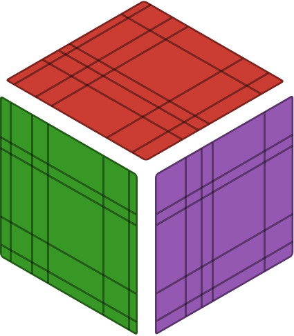

<p align="center">
  
</p>

# Bramble.jl

*Supraconvergent finite difference discretizations on nonuniform Cartesian grids.*

---

[](https://github.com/gpena/Bramble.jl/actions?query=workflow%3ACI++)
[](https://codecov.io/gh/gpena/Bramble.jl)
[](https://github.com/JuliaTesting/Aqua.jl)
[](https://github.com/aviatesk/JET.jl)
[](https://gpena.github.io/Bramble.jl/)
[](https://doi.org/10.5281/zenodo.17582286)
[](https://julialang.org)
[](https://github.com/gpena/Bramble.jl/blob/main/LICENSE)
[](https://github.com/SciML/SciMLStyle)

---

## Overview

Classical finite difference schemes often experience order reduction on nonuniform grids: local truncation errors drop from second-order to first-order due to the lack of grid uniformity.

`Bramble.jl` provides finite difference discretizations for partial differential equations on nonuniform Cartesian domains in 1D, 2D, and 3D that are mimetic and often lead to supraconvergence. Staggered dual meshes and metric-weighted inner products restore global second-order convergence on arbitrary, rough, or randomly spaced grids without requiring coordinate transformations.

Equations are defined through bilinear and linear forms, then assembled into sparse matrices (`SparseMatrixCSC`). This provides the structure of weak formulations while retaining the compact stencils and sparsity of finite differences.

---

## Features

- Nonuniform Cartesian meshes in 1D, 2D, and 3D with arbitrary point distributions.
- Weak form syntax (`form`, `assemble`) assembling directly into native `SparseMatrixCSC` matrices.
- Discrete calculus with metric-weighted forward ($D_{+x}$), backward ($D_{-x}$), and centered ($Dc_{x}$) difference operators alongside discrete inner products (`innerₕ`, `inner₊`).
- Allocation-free runtime kernels: in-place restriction (`Rₕ!`) and Gauss-Legendre cell averaging (`avgₕ!`) allocate 0 bytes in time-stepping loops.
- Boundary condition support for Dirichlet conditions, with a `symmetrize!` operator that restores symmetry for Cholesky factorizations.
- Composite grid spaces (`Wₕ^Val(N)`) with block matrix assembly for coupled PDE systems.
- End-to-end automatic differentiation via ForwardDiff and ReverseDiff through operators, form assembly, and nonlinear residuals.
- Export pipelines for visualization via VTK (`write_vtk`) in ParaView and PGFPlots/TikZ for LaTeX figures.

---

## Installation

Install `Bramble.jl` from GitHub using the Julia package manager:

```julia
using Pkg
Pkg.add(url = "https://github.com/gpena/Bramble.jl")
```

or from the Pkg REPL (type `]` from the Julia prompt):

```text
pkg> add https://github.com/gpena/Bramble.jl
```

---

## Quick start: 2D Poisson equation

Solve $-\Delta u = g$ on $\Omega = (0, 1)^2$ with Dirichlet boundary data $u|_{\partial\Omega} = e^{x+y}$ on a randomly perturbed nonuniform mesh:

```julia
using Bramble

# 1. Domain and nonuniform mesh
Ω = domain(interval(0.0, 1.0) × interval(0.0, 1.0))
Ωₕ = mesh(Ω, (32, 32), (false, false)) # (false, false) creates a random nonuniform grid
Wₕ = gridspace(Ωₕ)

# 2. Problem definitions (manufactured solution u_exact = exp(x + y))
u_exact(x) = exp(x[1] + x[2])
rhs(x) = -2 * u_exact(x)

# 3. Bilinear form (discrete Laplacian) and matrix assembly
a = form(Wₕ, Wₕ, (u, v) -> inner₊(∇₋ₕ(u), ∇₋ₕ(v)))
A = assemble(a; dirichlet_labels = :boundary)

# 4. Linear form (source term) and Dirichlet boundary conditions
gₕ = element(Wₕ)
avgₕ!(gₕ, rhs)
bcs = dirichlet_constraints(Bramble.set(Ω), :boundary => u_exact)
l = form(Wₕ, v -> innerₕ(gₕ, v))
F = assemble(l; dirichlet_conditions = bcs, dirichlet_labels = :boundary)

# 5. Solve linear system
uₕ = element(Wₕ)
uₕ .= A \ F

# 6. Verify second-order accuracy against exact solution
u_ref = element(Wₕ)
Rₕ!(u_ref, u_exact)
println("Error (normₕ): ", normₕ(uₕ - u_ref))
```

---

## Coupled systems

Multicomponent PDEs use composite grid spaces. Trial and test components are indexed via `p(i)` and `q(j)`:

```julia
# Composite space with 2 components (e.g. predator-prey or Stokes system)
Vₕ = Wₕ^Val(2)

# Coupled bilinear form accessing components directly
a = form(Vₕ, Vₕ, (p, q) ->
    inner₊(∇₋ₕ(p(1)), ∇₋ₕ(q(1))) + innerₕ(p(1), q(1)) +
    inner₊(∇₋ₕ(p(2)), ∇₋ₕ(q(2))) + innerₕ(p(2), q(2))
)

A = assemble(a; dirichlet_labels = :boundary)
```

---

## Workflow architecture

```
┌──────────────┐     ┌──────────────┐     ┌──────────────┐
│    Domain    │ ──> │     Mesh     │ ──> │  Grid Space  │
│  (Intervals, │     │ (Primary and │     │ (Scalar and  │
│   Markers)   │     │  Dual Grids) │     │  Composite)  │
└──────────────┘     └──────────────┘     └──────────────┘
                                                  │
                                                  ▼
┌──────────────┐     ┌──────────────┐     ┌──────────────┐
│ Linear Solve │ <── │   Assemble   │ <── │ Form Syntax  │
│  (A \ F or   │     │ (Sparse CSC, │     │ (Bilinear,   │
│  Iterative)  │     │ Constraints) │     │   Linear)    │
└──────────────┘     └──────────────┘     └──────────────┘
```

---

## Documentation

Documentation, tutorials, and the API reference are available at [https://gpena.github.io/Bramble.jl/](https://gpena.github.io/Bramble.jl/):

- [Getting Started & Tutorials](https://gpena.github.io/Bramble.jl/tutorials/geometry/)
- [Discrete Operators & Stencils](https://gpena.github.io/Bramble.jl/tutorials/operators/)
- [Forms & Assembly](https://gpena.github.io/Bramble.jl/tutorials/form/)
- [Automatic Differentiation](https://gpena.github.io/Bramble.jl/internals/autodiff/)
- [Worked Examples](https://gpena.github.io/Bramble.jl/examples/poisson_linear/)
  - Linear and Nonlinear Poisson Equations
  - Convection-Diffusion Equations
  - Coupled Reaction-Diffusion Systems

---

## Mathematical foundations

`Bramble.jl` implements discrete operators and inner products that reflect the supraconvergence theory developed in:

- J. A. Ferreira and R. D. Grigorieff, *On the supraconvergence of elliptic finite difference schemes*, Applied Numerical Mathematics 28 (1998), pp. 275–292. [doi:10.1016/S0168-9274(98)00048-8](https://doi.org/10.1016/S0168-9274(98)00048-8)
- S. Barbeiro, J. A. Ferreira, and R. D. Grigorieff, *Supraconvergence of a finite difference scheme for solutions in $H^s(0,L)$*, IMA Journal of Numerical Analysis 25.4 (2005), pp. 797–811. [doi:10.1093/imanum/dri018](https://doi.org/10.1093/imanum/dri018)
- J. A. Ferreira and R. D. Grigorieff, *Supraconvergence and Supercloseness of a Scheme for Elliptic Equations on Nonuniform Grids*, Numerical Functional Analysis and Optimization 27.5-6 (2006), pp. 539–564. [doi:10.1080/01630560600796485](https://doi.org/10.1080/01630560600796485)

---

## Citing Bramble.jl

If you use `Bramble.jl` in your research, please cite the software:

```bibtex
@software{bramble2025,
  author       = {Gon{\c{c}}alo Pena},
  title        = {{Bramble.jl}: Nonuniform Finite Difference Method Discretizations in Julia},
  doi          = {10.5281/zenodo.17582286},
  url          = {https://github.com/gpena/Bramble.jl}
}
```

---

## License

`Bramble.jl` is licensed under the [MIT License](LICENSE).
