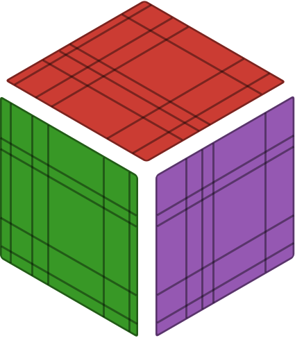
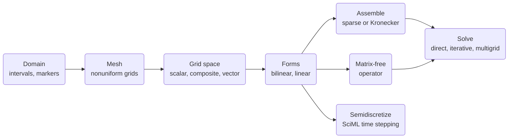

<p align="left">
  
</p>

# Bramble.jl

*Supraconvergent finite difference discretizations on nonuniform Cartesian grids.*

---

| **Documentation & DOI**  | [](https://gpena.github.io/Bramble.jl/) [](https://doi.org/10.5281/zenodo.14230821)                                                                                                                                                                                                                                                                                                 |
| :-------------------------| :-----------------------------------------------------------------------------------------------------------------------------------------------------------------------------------------------------------------------------------------------------------------------------------------------------------------------------------------------------------------------------------------------------------------------------------------------------------------------------------------------------------------------|
| **Testing & Quality**    | [](https://github.com/gpena/Bramble.jl/actions?query=workflow%3ACI++) [](https://codecov.io/gh/gpena/Bramble.jl) [](https://github.com/JuliaTesting/Aqua.jl) [](https://github.com/aviatesk/JET.jl) |
| **Platform & Standards** | [](https://julialang.org) [](https://github.com/gpena/Bramble.jl/blob/main/LICENSE) [](https://github.com/SciML/SciMLStyle)                                                                                                                                           |

---

## Overview

Classical finite difference schemes often lose accuracy on nonuniform grids: the local truncation error drops from second to first order once the spacing varies.

`Bramble.jl` provides finite difference discretizations of partial differential equations on nonuniform Cartesian grids in 1D, 2D and 3D that are mimetic and often supraconvergent. Staggered dual meshes and metric-weighted inner products restore global second-order convergence on graded, rough or randomly spaced grids, without coordinate transformations.

Problems are written as bilinear and linear forms built from discrete operators, in notation close to the mathematics. `assemble` turns them into a sparse matrix and a right-hand side, or they can be applied matrix-free. Time-dependent problems become ODE systems for the SciML time steppers.

---

## Features

- **Meshes.** Nonuniform Cartesian meshes in 1D, 2D and 3D, with uniform, graded or random point distributions, boundary markers and iterative refinement.
- **Discrete calculus.** Gradient, divergence, curl, Laplacian and strain operators (`∇ₕ`, `divₕ`, `curlₕ`, `Δₕ`, `εₕ`) in staggered, centered and averaged variants, jumps, means and index shifts, with discrete inner products and norms (`innerₕ`, `inner₊`, `inner_Γ`, `normₕ`) and point sources (`dirac`).
- **Forms and assembly.** `form` and `assemble` build sparse matrices and load vectors directly. Separable operators assemble as Kronecker products, and `matrix_free_operator` applies a form without storing its matrix.
- **Boundary conditions.** Dirichlet constraints by marker (`dirichlet_constraints`), restricted to chosen components of a system, with `symmetrize!` to keep symmetric problems symmetric.
- **Coupled systems.** Composite spaces (`Wₕ^Val(N)`) and vector spaces, with block assembly addressed by component.
- **Time-dependent problems.** `semidiscretize`, `ode_problem` and `second_order_ode_problem` hand first- and second-order systems to OrdinaryDiffEq and the rest of SciML.
- **Solvers.** `pde_solve` with sparse direct factorizations (SuiteSparse, Apple Accelerate, MUMPS, Sparspak), preconditioners (algebraic multigrid, ILU(0), Jacobi, Chebyshev) and geometric multigrid (`gmg_solve`).
- **Automatic differentiation.** Forward and reverse mode through operators, assembly and nonlinear residuals, via ForwardDiff, ReverseDiff and Enzyme, with sparse Jacobians and SciMLSensitivity adjoints for transient problems.
- **Backends.** Serial, threaded (Polyester) and GPU (Metal, via KernelAbstractions) execution, with CSC or CSR storage chosen through `backend`.
- **Visualization and export.** Plots and Makie recipes, VTK output for ParaView (`export_vtk`) and PGFPlots/TikZ output for LaTeX (`export_pgfplots`).

---

## Installation

Install `Bramble.jl` from GitHub using the Julia package manager:

```julia
using Pkg
Pkg.add(url = "https://github.com/gpena/Bramble.jl")
```

or from the Pkg REPL (type `]` from the Julia prompt):

```text
pkg> add https://github.com/gpena/Bramble.jl
```

---

## Quick start: 2D Poisson equation

Solve $-\Delta u = g$ on the unit square with zero boundary values and exact solution $u(x, y) = \sin(\pi x)\sin(\pi y)$, on a grid whose interior points are placed at random:

```julia
using Bramble

uexact(x) = sinpi(x[1]) * sinpi(x[2])
g(x) = 2π^2 * uexact(x)

Ω = domain(interval(0.0, 1.0) × interval(0.0, 1.0))   # the unit square
Ωₕ = mesh(Ω, (33, 33), (false, false))                # 33 × 33 points, randomly spaced
Wₕ = gridspace(Ωₕ)                                    # one unknown per point
gₕ = element(Wₕ)
Rₕ!(gₕ, g)                                            # the source, sampled at the points

a = form(Wₕ, Wₕ, (u, v) -> inner₊(∇ₕ(u), ∇ₕ(v)))    # the discrete Laplacian
l = form(Wₕ, v -> innerₕ(gₕ, v))                      # the load
A, F = assemble(a, l; dirichlet = dirichlet_constraints(Ω, :boundary => uexact))

uₕ = element(Wₕ)
uₕ .= A \ F
maximum(abs, uₕ .- Rₕ(Wₕ, uexact))                     # the error at the grid points
```

Passing `true` instead of `false` for an axis spaces its points uniformly.

---

## Coupled systems

Multicomponent PDEs use composite grid spaces. Trial and test components are indexed via `p(i)` and `q(j)`:

```julia
# Composite space with 2 components (e.g. predator-prey or Stokes system)
Vₕ = Wₕ^Val(2)

# Coupled bilinear form accessing components directly
a = form(Vₕ, Vₕ, (p, q) ->
    inner₊(∇ₕ(p(1)), ∇ₕ(q(1))) + innerₕ(p(1), q(1)) +
    inner₊(∇ₕ(p(2)), ∇ₕ(q(2))) + innerₕ(p(2), q(2))
)

A = assemble(a; dirichlet = :boundary)
```

---

## Workflow architecture


```mermaid
flowchart LR
    domain("Domain<br/>intervals, markers")
    mesh("Mesh<br/>nonuniform grids")
    space("Grid space<br/>scalar, composite, vector")
    form("Forms<br/>bilinear, linear")
    assemble("Assemble<br/>sparse or Kronecker")
    matfree("Matrix-free<br/>operator")
    solve("Solve<br/>direct, iterative, multigrid")
    ode("Semidiscretize<br/>SciML time stepping")
    domain --> mesh --> space --> form
    form --> assemble --> solve
    form --> matfree --> solve
    form --> ode
```

---

## Documentation

Documentation, tutorials, and the API reference are available at [https://gpena.github.io/Bramble.jl/](https://gpena.github.io/Bramble.jl/):

- [Getting started](https://gpena.github.io/Bramble.jl/getting_started/)
- Discrete foundations: [geometry](https://gpena.github.io/Bramble.jl/tutorials/geometry/), [meshes](https://gpena.github.io/Bramble.jl/tutorials/mesh/), [spaces](https://gpena.github.io/Bramble.jl/tutorials/space/), [operators](https://gpena.github.io/Bramble.jl/tutorials/operators/)
- Forms and assembly: [forms](https://gpena.github.io/Bramble.jl/tutorials/form/), [coupled systems](https://gpena.github.io/Bramble.jl/tutorials/coupled_systems/)
- Solvers and scientific computing: [solvers](https://gpena.github.io/Bramble.jl/tutorials/solvers/), [time stepping](https://gpena.github.io/Bramble.jl/tutorials/time_stepping/), [automatic differentiation](https://gpena.github.io/Bramble.jl/tutorials/autodiff/), [backends](https://gpena.github.io/Bramble.jl/tutorials/backend/)
- Visualization and export: [plotting](https://gpena.github.io/Bramble.jl/tutorials/plotting/), [VTK](https://gpena.github.io/Bramble.jl/tutorials/vtk_export/), [PGFPlots](https://gpena.github.io/Bramble.jl/tutorials/pgfplots_export/)
- [Worked examples](https://gpena.github.io/Bramble.jl/examples/poisson_linear/): stationary, time-dependent and inverse problems, and solver performance
- [Benchmarks](https://gpena.github.io/Bramble.jl/benchmarks/)

---

## Mathematical foundations

`Bramble.jl` implements discrete operators and inner products that reflect the supraconvergence theory developed in:

- J. A. Ferreira and R. D. Grigorieff, *On the supraconvergence of elliptic finite difference schemes*, Applied Numerical Mathematics 28 (1998), pp. 275–292. [doi:10.1016/S0168-9274(98)00048-8](https://doi.org/10.1016/S0168-9274(98)00048-8)
- S. Barbeiro, J. A. Ferreira, and R. D. Grigorieff, *Supraconvergence of a finite difference scheme for solutions in $H^s(0,L)$*, IMA Journal of Numerical Analysis 25.4 (2005), pp. 797–811. [doi:10.1093/imanum/dri018](https://doi.org/10.1093/imanum/dri018)
- J. A. Ferreira and R. D. Grigorieff, *Supraconvergence and Supercloseness of a Scheme for Elliptic Equations on Nonuniform Grids*, Numerical Functional Analysis and Optimization 27.5-6 (2006), pp. 539–564. [doi:10.1080/01630560600796485](https://doi.org/10.1080/01630560600796485)

---

## Citing Bramble.jl

If you use `Bramble.jl` in your research, please cite the software:

```bibtex
@software{bramble2026,
  author       = {Gon{\c{c}}alo Pena},
  title        = {{Bramble.jl}: Nonuniform Finite Difference Method Discretizations in Julia},
  doi          = {10.5281/zenodo.14230821},
  url          = {https://github.com/gpena/Bramble.jl}
}
```

---

## Acknowledgements

The development of Bramble.jl was assisted by Generative AI models (Google Gemini and Anthropic Claude), which were used for code drafting, refactoring and debugging.

---

## License

`Bramble.jl` is licensed under the [MIT License](LICENSE).
