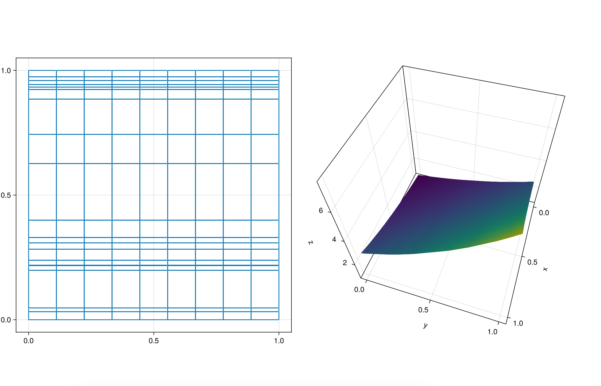

```@meta
CurrentModule = Bramble
```

# Linear Poisson equation

In this section, we'll demonstrate how to utilize `Bramble.jl` to solve a linear Poisson equation with Dirichlet boundary conditions.

---

## Problem description

Let's consider the following Poisson equation on a ``n``-dimensional square domain (``n=1,2,3``),

```math
\begin{align*}
- \Delta u (x) &= f(x), \, x \in \Omega \\
u(x) &= g(x), \, x \in \partial \Omega
\end{align*}
```

where ``\Omega = (a,b)^n``.

In order to have a working example of our Poisson problem we aim to solve, lets take ``n=2`` and define

```math
u(x,y) = e^{x + y}, \, (x,y) \in [0,1]^2
```

and calculate ``f`` and ``g`` accordingly.

## Discretization

The former problem can be discretized with finite differences based on a nonuniform grid. We will now detail the mathematical tools needed to formalize our discretization method.

Let us denote by ``\Lambda`` a sequence of vectors ``h=(h_{x_1}, h_{x_2})``, where ``h_x = (h_{x,1}, h_{x,2}, \dots, h_{x,N_x})``, ``h_y = (h_{y,1}, h_{y,2}, \dots, h_{y,N_y})`` and ``h_{x,j}, h_{y,j} >0``. Let us denote by ``h_{max}`` the maximum over all values of ``h_{x,j}`` and ``h_{y,j}``.

For each ``h \in \Lambda``, we define the grid space

```math
\overline{\Omega}_h = \set{(x_i, y_j) \in \mathbb{R}^2: x_0 = y_0 = 0, x_i = x_{i-1} + h_{x,i}, i=1,\dots,N_x,  y_j = x_{j-1} + h_{y,j}, j=1,\dots,N_y }.
```

We also denote by ``\partial \overline{\Omega}_h``, the subset of grid points corresponding to the boundary ``\partial \Omega``. Built upon these grids, we introduce the discrete spaces of grid functions

```math
W_h(\overline{\Omega}_h) = \set{u_h: \overline{\Omega}_h: \longrightarrow \mathbb{R}}
```

as well as ``W_{h,0}(\overline{\Omega}_h) \subseteq W_h(\overline{\Omega}_h)``, its subspace of function zero at the boundary.

Finally, we introduce some notations for functions ``u_h`` and ``v_h`` in ``W_h(\overline{\Omega}_h)``

```math
(u_h,v_h)_h = \sum_{i=1}^{N_x}\sum_{j=1}^{N_y} |\square_{i,j}| u_h(x_i, y_j) v_h(x_i,y_j),
```

```math
(u_h,v_h)_{+x} = \sum_{i=1}^{N_x}\sum_{j=1}^{N_y-1} h_{x,i} h_{y,j+1/2} u_h(x_i, y_j) v_h(x_i,y_j)
```

```math
(u_h,v_h)_{+y} = \sum_{i=1}^{N_x-1}\sum_{j=1}^{N_y} h_{x,i+1/2} h_{y,j} u_h(x_i, y_j) v_h(x_i,y_j)
```

where ``\square_{i,j} = \left[x_i-\frac{h_{x,i}}{2}, x_i+\frac{h_{x,i+1}}{2} \right] \times \left[y_j-\frac{h_{y,j}}{2}, y_j+\frac{h_{y,j+1}}{2} \right]``, ``|\square_{i,j}|`` is its area and ``h_{\cdot,i+1/2} = \frac{h_{\cdot,i}-h_{\cdot,i+1}}{2}``.

If ``D_{-x}`` and ``D_{-y}`` denote the standard backward difference operators defined on the grid points of ``\overline{\Omega}_h``, then, we can formulate the following discrete problem:

> find ``u_h \in W_h(\overline{\Omega}_h)``, with ``u_h(x_i,y_j) = u(x_i,y_j)`` on ``\partial \overline{\Omega}_h,`` such that
>
> ```math
> (D_{-x}u_h, D_{-x}v_h)_{+x} + (D_{-y}u_h, D_{-y}u_h)_{+y} = ((g)_h, v_h)_h, \, \forall  v_h  \in W_{h,0}(\overline{\Omega}_h).
> ```

Here, the ``(\cdot)_h`` operator is defined as follows

```math
(g)_h (x_i,y_j) = \frac{1}{|\square_{ij}|} \iint_{\square_{ij}} g(x)\, dxdy.
```

This defines a discretization that can be seen both as a finite difference and finite element method. It can be shown that under certain smoothness assumptions on ``f`` and ``g``, the former problem has a unique solution ``u_h`` such that

```math
\Vert R_h u - u_h \Vert_{1h} \leq C h_{max}^ 2,
```

where

```math
\Vert v_h \Vert_{1h} = \sqrt{\Vert v_h \Vert_{h}^2 + \Vert D_{-x} v_h \Vert_{h,x}^2 + \Vert D_{y} v_h \Vert_{h,y}^2}
```

and

```math
\begin{aligned}
\Vert v_h \Vert_{h} &= \sqrt{(v_h,v_h)_h},\\
 \Vert D_{-x} v_h \Vert_{h,x} &= \sqrt{(D_{-x} v_h, D_{-x} v_h)_{+x}},\\
 \Vert D_{-y} v_h \Vert_{h,y} &= \sqrt{(D_{-y} v_h, D_{-y} v_h)_{+y}}.
 \end{aligned}
```

## Implementation

We can now use `Bramble.jl` to calculate ``u_h``. As with any Julia package, we start by importing `Bramble.jl` and a few other packages we will need down the line

```julia
using Bramble
using LinearSolve       # solvers for linear systems
using IncompleteLU: ilu # incomplete LU for preconditioning
```

We start by building a grid associated with the Poisson equation's domain, as well as, the solution (to impose Dirichlet boundary conditions) and the equation's right hand side `g`.

```julia
I = interval(0, 1)
Ω = domain(I × I)
Ωₕ = mesh(Ω, (10, 20), (true, false))
```

The first two lines create a [domain](@ref Domain) object, while the third generates a [mesh](@ref mesh(Ω::Domain, npts::NTuple{D,Int}, unif::NTuple{D,Bool}) where D
) with 10 and 20 points along the `x` and `y` directions, respectively. The last input argument encodes that we want a uniform grid in the `x` axis and random generated points in the `y` axis.

We now move on to prepare and define functions `f` and `g` associated with the problem as [BrambleBareFunction](@ref). This is a needed step to prepare these function to work well the the internal machinery of `Bramble.jl`:

```julia
sol = @embed(Ωₕ, x -> exp(sum(x)))
rhs = @embed(Ωₕ, x -> -2 * sol(x))
```

The next line of code builds a marker structure with the information the equation has a Dirichlet boundary condition over the boundary of `Ωₕ` (the whole boundary is the default option) defined by function `sol`.

```julia
bc = dirichletbcs(sol)
```

We now build the [gridspace](@ref) and define the `linear` and `bilinear` forms associated with the discrete variational problem presented. We create the discrete space with

```julia
Wₕ = gridspace(Ωₕ)
```

and move on to define the bilinear form and assembling the associated matrix

```julia
bform = form((uₕ, vₕ) -> inner₊(∇₋ₕ(uₕ), ∇₋ₕ(vₕ)), Wₕ, Wₕ)
A = assemble(bform, bc)
```

In this case, we provide to the `assemble` function the information on boundary conditions in order to have this information encoded in matrix `A`.

Next, we create an [element](@ref) in the gridspace whose components are calculated with the [averaging operator](@ref avgₕ!) introduced before

```julia
uₕ = element(Wₕ)
avgₕ!(uₕ, rhs)
```

We now define the linear forms associated with the right hand side

```julia
lform = form(vₕ -> innerₕ(uₕ, vₕ), Wₕ)
F = assemble(lform, bc)
```

and assemble vector `F`. The solution of the linear system `Ax=F` will provide the components of vector `uₕ`, solution of the discrete variational problem. To solve the system, we use GMRES (package [LinearSolve.jl](https://github.com/SciML/LinearSolve.jl)) preconditioned with an incomplete LU factorization as precondition (package [incompleteLU.jl](https://github.com/haampie/IncompleteLU.jl))

```julia
prob = LinearProblem(A, F)
solₕ = LinearSolve.solve(prob, KrylovJL_GMRES(), Pl = ilu(A, τ = 0.0001))

uₕ .= solₕ.u
```

and calculate the solution. If we want to calculate the error associated with this approximate solution (w.r.t [norm₁ₕ](@ref)), we can follow with

```julia
F .= uₕ
Rₕ!(uₕ, sol)
uₕ .-= F

norm₁ₕ(uₕ)
```

We can even use [GLMakie](https://github.com/JuliaPlots/GLMakie.jl) to plot the solution

```julia
using GLMakie

x = points(Ωₕ(1))
y = points(Ωₕ(2))

reshaped_uₕ = reshape(uₕ, 10, 20)

fig = Figure(size = (1200, 800))
ax1 = Axis(fig[1, 1], aspect = 1)
ax2 = Axis3(fig[1, 2], aspect = (1, 1, 1),
      perspectiveness = 0.5,
      elevation = π / 3.5,
      azimuth = 0.1π)

wireframe!(ax1, x, y, reshaped_uₕ) # mesh plot
surface!(ax2, x, y, reshaped_uₕ)   # solution plot
```



or export it to a `vtk` format to visualize, for instance, with [Paraview](https://www.paraview.org/).

```julia
export_file = "surf"
vtk_grid(export_file, x, y, z) do vtk
    vtk["poisson"] = vis_uₕ
end

vtk_save(vtk)
```
