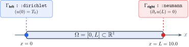
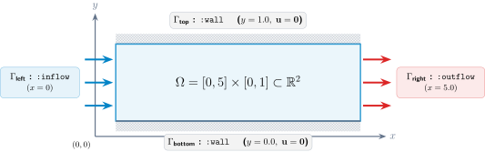
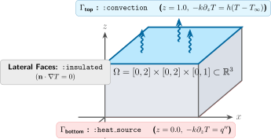

```@meta
CurrentModule = Bramble
```

# [Geometry Tutorial](@id tutorial_geometry)

`Bramble.jl` provides a high-performance, zero-allocation geometric modeling subsystem designed for partial differential equations (PDEs) and numerical discretization schemes on Cartesian and tensor-product meshes.

In this tutorial, you will learn how to:
1. Construct 1D intervals and multi-dimensional [`CartesianProduct`](@ref)s.
2. Handle collapsed (lower-dimensional) geometries.
3. Query spatial and topological dimensions, bounds, centers, and containment.
4. Define boundary labels and markers with [`markers`](@ref) and [`@markers`](@ref).
5. Build complete computational [`Domain`](@ref)s ready for mesh generation and PDE solvers.

---

## 1. Sets and Intervals (`CartesianProduct`)

At the core of the geometry system is `CartesianProduct{D, T}`, which represents the Cartesian product of $D$ closed intervals in $\mathbb{R}^D$ with coordinate type `T`.

### 1.1 Creating 1D Intervals

Use [`interval`](@ref) to define closed intervals $[a, b] \subset \mathbb{R}$:

```julia
using Bramble

# Define the interval [0.0, 1.0]
I = interval(0.0, 1.0)

# Automatic conversion of integer bounds to floating point
I_int = interval(0, 2)  # CartesianProduct{1, Float64}

# Create a single degenerate point [0.5, 0.5]
P = point(0.5)

# Bounding box of any two numbers (ordered automatically)
B = box(1.5, 0.2)       # [0.2, 1.5]
```

### 1.2 Multi-Dimensional Sets via the Tensor Product Operator `×`

Multi-dimensional hyper-rectangles are constructed intuitively by taking the tensor product of lower-dimensional sets using the `×` (`\times<tab>`) operator:

```julia
# 2D Unit square: [0, 1] × [0, 1]
Ω_2d = interval(0.0, 1.0) × interval(0.0, 1.0)

# 3D Cuboid: [-1, 1] × [0, 2] × [0, 0.5]
Ω_3d = interval(-1.0, 1.0) × interval(0.0, 2.0) × interval(0.0, 0.5)
```

Alternatively, you can construct products directly using tuples of interval pairs:

```julia
# Direct tuple construction
Ω_2d = cartesian_product(((0.0, 1.0), (0.0, 2.0)))
```

---

## 2. Querying Geometric Properties

`Bramble.jl` provides a comprehensive, type-stable query interface:

```julia
X = interval(0.0, 2.0) × interval(-1.0, 1.0)

# Spatial embedding dimension (D = 2)
dim(X)            # 2

# Topological dimension
topo_dim(X)       # 2

# Interval bounds
tails(X)          # ((0.0, 2.0), (-1.0, 1.0))
tails(X, 1)       # (0.0, 2.0)  -- bounds in dimension 1
tails(X, 2)       # (-1.0, 1.0) -- bounds in dimension 2

# Geometric center
center(X)         # (1.0, 0.0)

# 1D projection onto a specific axis
proj_x = projection(X, 1)  # interval(0.0, 2.0)
```

### Point Containment (`in` / `∈`)

Check whether a point lies within a `CartesianProduct`:

```julia
# In 1D:
I = interval(0.0, 1.0)
0.5 ∈ I           # true
1.5 ∈ I           # false

# In 2D (supports Tuples, SVector, and Vectors):
X = interval(0.0, 1.0) × interval(0.0, 1.0)
(0.5, 0.5) ∈ X    # true
(1.2, 0.3) ∈ X    # false
```

---

## 3. Collapsed and Lower-Dimensional Geometries

A dimension is considered **collapsed** if its interval is degenerate ($a = b$). Bramble accurately tracks collapsed dimensions without heap allocations, enabling seamless modeling of lower-dimensional surfaces or interfaces embedded in higher-dimensional spaces:

```julia
# 1D line embedded in 2D space: x ∈ [0, 1], y = 0
line_in_2d = interval(0.0, 1.0) × point(0.0)

dim(line_in_2d)       # 2 (spatial embedding dimension)
topo_dim(line_in_2d)  # 1 (topological dimension)

# Check if individual dimensions are collapsed
line_in_2d.collapsed[1]  # false (x-axis is extended)
line_in_2d.collapsed[2]  # true  (y-axis is collapsed)
```

---

## 4. Boundary Markers (`markers` and `@markers`)

PDE boundary conditions require tagging specific domain boundaries (e.g., Dirichlet, Neumann, Robin, inflow/outflow).

### 4.1 Boundary Symbol Conventions

For a $D$-dimensional domain, the standard boundary facets are:
- **1D**: `:left`, `:right`
- **2D**: `:bottom`, `:top`, `:left`, `:right`
- **3D**: `:bottom`, `:top`, `:back`, `:front`, `:left`, `:right`

You can inspect standard boundary symbols using [`get_boundary_symbols`](@ref):

```julia
get_boundary_symbols(2)
# (:bottom, :top, :left, :right)
```

### 4.2 Creating Markers

Markers are defined as `:label => :identifier` pairs where `:identifier` can be a single boundary symbol, a tuple of symbols, or a boolean function:

```julia
geom = interval(0.0, 5.0) × interval(0.0, 1.0)

# Define markers on the geometry:
m = markers(
    geom,
    :inflow  => :left,
    :outflow => :right,
    :wall    => (:top, :bottom)
)

# Retrieve all defined labels
collect(labels(m))
# [:inflow, :outflow, :wall]
```

---

## 5. Computational Domains (`Domain`)

A [`Domain`](@ref) joins a geometric set (`CartesianProduct`) with its boundary markers into a single unified object:

```julia
# 1. Define geometry
geom = interval(0.0, 1.0) × interval(0.0, 1.0)

# 2. Construct domain with inline boundary markers
Ω = domain(
    geom,
    :dirichlet => (:left, :right),
    :neumann   => (:top, :bottom)
)

# Or create a default domain marking all external boundaries as :boundary
Ω_default = domain(geom)
```

### 5.1 Domain Trait Delegation

`Domain` automatically delegates geometric and marker methods directly:

```julia
dim(Ω)            # 2
topo_dim(Ω)       # 2
tails(Ω)          # ((0.0, 1.0), (0.0, 1.0))
center(Ω)         # (0.5, 0.5)
(0.5, 0.5) ∈ Ω    # true

# Access underlying set and markers
set(Ω)            # CartesianProduct{2, Float64}
markers(Ω)        # DomainMarkers
collect(labels(Ω)) # [:dirichlet, :neumann]
```

---

## 6. Practical Examples

### Example 1: 1D Rod with Mixed Boundary Conditions

Consider heat conduction along a 1D rod $\Omega = [0, L]$ with $L = 10.0$, fixed temperature at $x = 0$ (`:left`) and insulated end at $x = L$ (`:right`):



```julia
L = 10.0
rod_geom = interval(0.0, L)

# Define domain with Dirichlet left boundary and Neumann right boundary
rod = domain(
    rod_geom,
    :dirichlet => :left,
    :neumann   => :right
)

println("Domain: ", rod)
println("Dimension: ", dim(rod))
println("Active Labels: ", collect(labels(rod)))
```

---

### Example 2: 2D Channel Flow Domain

Consider fluid flow in a rectangular channel $[0, 5] \times [0, 1]$ with an inflow on the left, outflow on the right, and no-slip walls on top and bottom:



```julia
channel_geom = interval(0.0, 5.0) × interval(0.0, 1.0)

channel = domain(
    channel_geom,
    :inflow  => :left,
    :outflow => :right,
    :wall    => (:top, :bottom)
)

@assert dim(channel) == 2
@assert (2.5, 0.5) ∈ channel
println("Channel labels: ", collect(labels(channel)))
```

---

### Example 3: 3D Heat Sink Domain

Consider heat dissipation across a 3D block $[0, 2] \times [0, 2] \times [0, 1]$ subjected to a bottom heat source, top convective cooling, and insulated lateral walls:



```julia
sink_geom = interval(0.0, 2.0) × interval(0.0, 2.0) × interval(0.0, 1.0)

sink = domain(
    sink_geom,
    :heat_source => :bottom,
    :convection  => :top,
    :insulated   => (:left, :right, :front, :back)
)

println("3D Domain Center: ", center(sink))
println("Active Labels: ", collect(labels(sink)))
```
