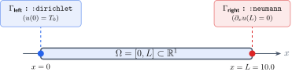
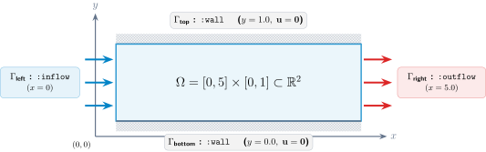
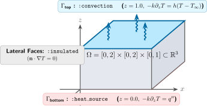

```@meta
CurrentModule = Bramble
```

# [Geometry tutorial](@id tutorial_geometry)

**What you will learn.** How to describe where a problem lives: a set, the names of its boundary pieces, and the domain that bundles both.

**What you need first.** Only a working install, see [Getting started](../getting_started.md).

**Where next.** The [mesh tutorial](@ref tutorial_mesh) turns a domain into a grid of points.

Every block below runs when this page is built, so the printed values are the ones the code produces.

---

## A first domain: a rod

Take a rod of length 10, held at a fixed temperature at its left end and insulated at the right end. The geometry is an interval, and the two ends need names so that a condition can later be attached to each:



```@example geometry
using Bramble
import Bramble: point, center, projection, topo_dim

rod = domain(interval(0.0, 10.0), :dirichlet => :left, :neumann => :right)

dim(rod), center(rod), collect(labels(rod))
```

[`interval`](@ref) builds the closed interval ``[0, 10]``. Each `label => side` pair is a **marker**: a name for a piece of the boundary. [`domain`](@ref) bundles the set with its markers, and a [`Domain`](@ref) is what [`mesh`](@ref) takes. `dim` is the dimension of the space the rod lives in, and `center` its midpoint.

Without markers, `domain(interval(0.0, 10.0))` labels the whole external boundary `:boundary`.

!!! tip "Try this"
    Replace the interval by `interval(0.0, 10.0) × interval(0.0, 1.0)` and keep the two markers. `dim` becomes 2, and `:left` and `:right` now name the two short sides of a strip: the same words mean the same faces in every dimension.

---

## Sets in more than one dimension

The tensor product operator `×` (`\times<tab>`) builds hyper-rectangles from intervals:

```@example geometry
I = interval(0.0, 1.0)
Ω_2d = I × I
Ω_3d = interval(-1.0, 1.0) × interval(0.0, 2.0) × interval(0.0, 0.5)
```

A set answers geometric questions. `∈` accepts a number in 1D, and a tuple, `SVector` or `Vector` above it:

```@example geometry
X = interval(0.0, 2.0) × interval(-1.0, 1.0)

dim(X), extrema(X), extrema(X, 1), center(X)
```

```@example geometry
0.5 ∈ I, 1.5 ∈ I, (0.5, 0.5) ∈ Ω_2d, (1.2, 0.3) ∈ Ω_2d
```

`extrema(X, 1)` is the range along the first axis, and `projection(X, 1)` is that axis as an interval.

!!! tip "Try this"
    Evaluate `(1.2, 0.3) ∈ X` and `(1.2, 1.3) ∈ X`. The second point leaves the box through the top.

---

## Naming boundary pieces

A marker is a `:label => identifier` pair. The identifier is one boundary symbol, a tuple of them, or a predicate. Boundary symbols are coordinate-aligned (`:xmin`, `:xmax`, `:ymin`, `:ymax`, and so on, with aliases such as `:left` and `:top`), and the [reference](@ref geometry_reference) below lists them all.

A channel with inflow on the left, outflow on the right and no-slip walls on top and bottom:



```@example geometry
geom = interval(0.0, 5.0) × interval(0.0, 1.0)

channel = domain(
    geom,
    :inflow => :left,
    :outflow => :right,
    :wall => (:top, :bottom)
)

dim(channel), center(channel), collect(labels(channel))
```

The tuple `(:top, :bottom)` gives one name to two faces. Markers are only names at this stage: no boundary condition is attached until a problem is posed on the mesh built from the domain, see the [form tutorial](form.md).

!!! tip "Try this"
    Change `:wall => (:top, :bottom)` to `:top_wall => :top, :bottom_wall => :bottom`, and print `collect(labels(channel))` again. Two names let a later problem treat the two walls differently.

---

## A domain in three dimensions

The same two ideas, a set and named faces, carry over unchanged. A heat sink, heated below, cooled above and insulated on its four sides:



```@example geometry
sink = domain(
    interval(0.0, 2.0) × interval(0.0, 2.0) × interval(0.0, 1.0),
    :heat_source => :zmin,
    :convection => :zmax,
    :insulated => (:xmin, :xmax, :ymin, :ymax)
)

center(sink), collect(labels(sink))
```

A `Domain` forwards the geometric queries of the previous sections to its set:

```@example geometry
Ω = domain(
    I × I,
    :dirichlet => (:left, :right),
    :neumann => (:top, :bottom)
)

dim(Ω), center(Ω), (0.5, 0.5) ∈ Ω, Bramble.is_collapsed(Ω)
```

[`Bramble.set`](@ref) returns the underlying set. Next, the [mesh tutorial](@ref tutorial_mesh) discretizes a domain into points.

---

## [Reference](@id geometry_reference)

### Boundary symbols

Boundary symbols are coordinate-aligned, so the same name means the same face in every dimension:

- **1D**: `:xmin` (`:left`), `:xmax` (`:right`)
- **2D**: `:xmin` (`:left`), `:xmax` (`:right`), `:ymin` (`:bottom`), `:ymax` (`:top`)
- **3D**: `:xmin` (`:back`), `:xmax` (`:front`), `:ymin` (`:left`), `:ymax` (`:right`), `:zmin` (`:bottom`), `:zmax` (`:top`)

The viewpoint-dependent names in parentheses are aliases. [`boundary_symbols`](@ref) lists the canonical set for a given dimension:

```@example geometry
boundary_symbols(2)
```
```@raw html
<figure>
<svg viewBox="0 0 780 280" width="100%" style="max-width:780px;height:auto;font-family:system-ui,-apple-system,'Segoe UI',sans-serif"
     xmlns="http://www.w3.org/2000/svg" role="img"
     aria-label="Diagram of standard boundary symbols in 2D (:xmin/:left, :xmax/:right, :ymin/:bottom, :ymax/:top) and 3D (:xmin/:back, :xmax/:front, :ymin/:left, :ymax/:right, :zmin/:bottom, :zmax/:top).">
  <!-- Panel 1: 2D Domain -->
  <g transform="translate(30, 20)">
    <rect x="0" y="0" width="320" height="240" rx="6" fill="none" stroke="currentColor" stroke-opacity="0.2" stroke-width="1"/>
    <text x="160" y="28" font-size="14" font-weight="bold" fill="currentColor" text-anchor="middle">2D boundary facets</text>

    <!-- 2D Box -->
    <rect x="80" y="70" width="160" height="120" fill="currentColor" fill-opacity="0.05" stroke="currentColor" stroke-width="2"/>

    <!-- Labels -->
    <!-- :ymax / :top -->
    <text x="160" y="58" font-size="12" font-weight="bold" fill="#ef4444" text-anchor="middle">:ymax (:top)</text>
    <line x1="80" y1="70" x2="240" y2="70" stroke="#ef4444" stroke-width="3"/>

    <!-- :ymin / :bottom -->
    <text x="160" y="210" font-size="12" font-weight="bold" fill="#ef4444" text-anchor="middle">:ymin (:bottom)</text>
    <line x1="80" y1="190" x2="240" y2="190" stroke="#ef4444" stroke-width="3"/>

    <!-- :xmin / :left -->
    <text x="35" y="134" font-size="12" font-weight="bold" fill="#3b82f6" text-anchor="middle">:xmin</text>
    <text x="35" y="148" font-size="10" fill="#3b82f6" text-anchor="middle">(:left)</text>
    <line x1="80" y1="70" x2="80" y2="190" stroke="#3b82f6" stroke-width="3"/>

    <!-- :xmax / :right -->
    <text x="285" y="134" font-size="12" font-weight="bold" fill="#3b82f6" text-anchor="middle">:xmax</text>
    <text x="285" y="148" font-size="10" fill="#3b82f6" text-anchor="middle">(:right)</text>
    <line x1="240" y1="70" x2="240" y2="190" stroke="#3b82f6" stroke-width="3"/>
  </g>

  <!-- Panel 2: 3D Isometric Domain -->
  <g transform="translate(410, 20)">
    <rect x="0" y="0" width="340" height="240" rx="6" fill="none" stroke="currentColor" stroke-opacity="0.2" stroke-width="1"/>
    <text x="170" y="28" font-size="14" font-weight="bold" fill="currentColor" text-anchor="middle">3D boundary facets</text>

    <!-- Isometric Box Coordinates -->
    <!-- Back/interior edges dashed -->
    <line x1="130" y1="70"  x2="130" y2="150" stroke="currentColor" stroke-dasharray="3,3" stroke-width="1" stroke-opacity="0.4"/>
    <line x1="70"  y1="190" x2="130" y2="150" stroke="currentColor" stroke-dasharray="3,3" stroke-width="1" stroke-opacity="0.4"/>
    <line x1="130" y1="150" x2="250" y2="150" stroke="currentColor" stroke-dasharray="3,3" stroke-width="1" stroke-opacity="0.4"/>

    <!-- Top face (:zmax) -->
    <polygon points="70,110 130,70 250,70 190,110" fill="#ef4444" fill-opacity="0.1" stroke="#ef4444" stroke-width="1.5"/>
    <text x="160" y="94" font-size="11" font-weight="bold" fill="#ef4444" text-anchor="middle">:zmax (:top)</text>

    <!-- Right face (:ymax) -->
    <polygon points="190,110 250,70 250,150 190,190" fill="#3b82f6" fill-opacity="0.1" stroke="#3b82f6" stroke-width="1.5"/>
    <text x="225" y="135" font-size="11" font-weight="bold" fill="#3b82f6" text-anchor="middle">:ymax (:right)</text>

    <!-- Front face (:xmax) -->
    <polygon points="70,110 190,110 190,190 70,190" fill="#10b981" fill-opacity="0.1" stroke="#10b981" stroke-width="1.5"/>
    <text x="130" y="155" font-size="11" font-weight="bold" fill="#10b981" text-anchor="middle">:xmax (:front)</text>

    <!-- Left callout (:ymin) -->
    <text x="35" y="150" font-size="11" font-weight="bold" fill="#3b82f6" text-anchor="middle">:ymin (:left)</text>
    <!-- Back callout (:xmin) -->
    <text x="190" y="60" font-size="11" font-weight="bold" fill="#10b981" text-anchor="middle">:xmin (:back)</text>
    <!-- Bottom callout (:zmin) -->
    <text x="130" y="215" font-size="11" font-weight="bold" fill="#ef4444" text-anchor="middle">:zmin (:bottom)</text>
  </g>
</svg>
</figure>
```

### Collapsed sets

A dimension is **collapsed** when its interval is degenerate (``a = b``), which is how a surface or interface embedded in a higher-dimensional space is written. `dim` is the embedding dimension and `topo_dim` the topological one; they differ only for a collapsed set. [`Bramble.is_collapsed`](@ref) answers per axis; it is public but not exported, hence the prefix:

```@example geometry
line_in_2d = interval(0.0, 1.0) × point(0.0)

dim(line_in_2d), topo_dim(line_in_2d),
Bramble.is_collapsed(line_in_2d, 1), Bramble.is_collapsed(line_in_2d, 2)
```

Related constructors: `interval(0, 2)` converts integer bounds to `Float64`, `point(0.5)` is the degenerate interval ``[0.5, 0.5]``, and `box(1.5, 0.2)` sorts its bounds.

### Predicate and time-dependent markers

A predicate marks any subset, not only a face. A marker set built over a time interval takes `(p, t)` predicates:

```@example geometry
using LinearAlgebra

m_cond = markers(
    geom,
    :inflow => :left,
    :hot_spot => (p -> p[1] > 2.5 && p[2] ≈ 0.0)
)

m_time = markers(
    geom,
    interval(0.0, 10.0),
    :moving_source => ((p, t) -> norm(p .- [t, 0.5]) < 0.2)
)

collect(labels(m_cond)), m_time(1.5)      # the second is the marker set frozen at t = 1.5
```

`labels` flattens the three marker kinds through `Iterators.flatten`. Inside a loop that must not allocate, iterate `label_symbols`, `label_tuples` or `label_conditions` instead.
